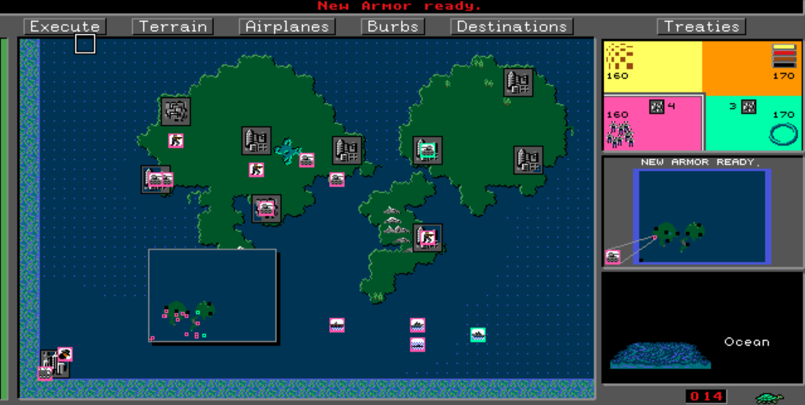
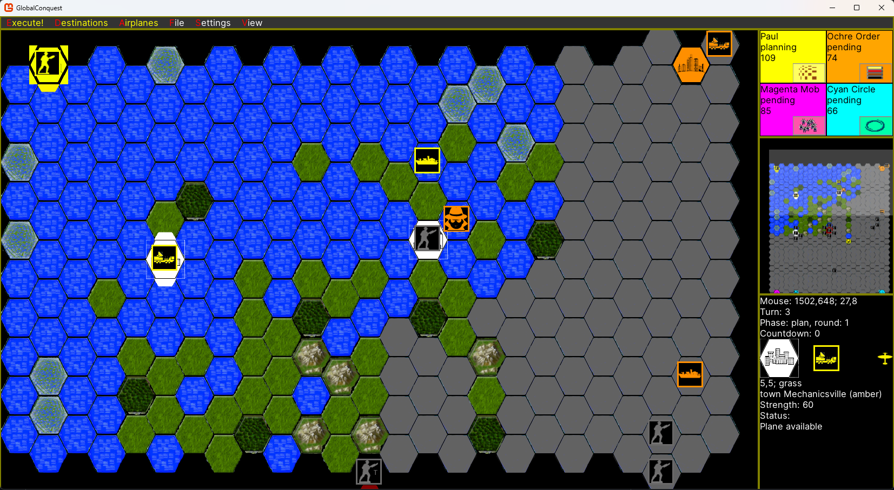

# Global Conquest 2025

Global Conquest 2025 is a redo of the multi-player DOS game released in 1992.
* https://en.wikipedia.org/wiki/Global_Conquest
* https://archive.org/details/globalconquestmanual/GlobalConquest-Manual/

The original was a follow-up to the game Command HQ, https://en.wikipedia.org/wiki/Command_HQ, and also has its roots in the computer game Empire, https://en.wikipedia.org/wiki/Empire_(1977_video_game).

Global Conquest is essentially a 4x game - "explore, expand, exploit, and exterminate".
The original Global Conquest was unique in its game play, as it provided a modified real-time experience.
With turn based games, one player makes a move and then resolves their actions. Then the next player, in turn, does the same. Game state is only modified one player at a time. Without any timer constraints, players can take as much time as they like to make their best possible move. I.e., consider chess as an example.
With real time games, players take actions simultaneously and those actions are resolved in real time. There are rewards for thinking fast and having quick and efficient interactions with the user interface. This potentially means some players can get more done than their opponents if they are more dexterious.
The Global Conquest hybrid approach allows for players to simultaneously plan their actions, but then action resolution happens separately without further player interaction during an execution phase. Different execution trigger configurations allow the game to more closely resemble a turn-based game or even approach a real-time game experience.
The planning and execution phase system make it similar to tactical combat games like Baulder's Gate 3 or XCom, but abstracted to a strategic level.

## Screenshots
### Original 1992 DOS Game

### WIP for Globabl Conquest 2025

## Installation
### Windows
The easiest option for running Global Conquest 2025 is to download the [pre-built binary zip package](https://github.com/pdhummel/GlobalConquest/releases) to a 64 bit Windows machine. And then run `GlobalConquest.exe`.  
You will also need to install other DotNet bits like these:
* https://aka.ms/dotnet-core-applaunch?framework=Microsoft.NETCore.App&framework_version=8.0.0&arch=x64&rid=win10-x64
* https://aka.ms/dotnet-core-applaunch?framework=Microsoft.WindowsDesktop.App&framework_version=8.0.0&arch=x64&rid=win-x64&os=win10

### MacOS
Download the [pre-built binary package](https://github.com/pdhummel/GlobalConquest/releases/download/v0.7.2/GlobalConquest-v0.7.2-macos64.zip) to a MacOS machine.  
Then open a Terminal window (Applications|Utilities|Terminal OR from Spotlight type "terminal") to run the following commands:  
`cd ~/Downloads`  
`gzip -d GlobalConquest-v0.7.2.tar.gz`  
`tar xvf GlobalConquest-v0.7.2.tar`  
`cd GlobalConquest-v0.7.2-macos64`  
`xattr -d com.apple.quarantine ./GlobalConquest`  
`./GlobalConquest`  

## User Interface
This is best supported by mouse and keyboard. However, some effort has been made to work with game controllers as well.
### Mouse
* Mouse move used to move the mouse cursor.
* Left click is used to select menu option items and activate buttons.
* Left click on a hex on the main map will give information about that hex in the bottom right details panel.
* Left click on the mini-map will update the position of the focus box and recenter the main map accordingly.
* Right click on a unit you own, and a context menu will appear.
  * The Move action will make a line appear indicating the unit path. 
    * Click the left mouse button on a hex to select the target so the unit will move there.
    * Long/hard click of the left mouse button to set a waypoint for movement and to draw a line to the next segment in the unit path.
* Right click on an unoccupied burb hex you own, and a context menu will appear.

### Keyboard
* Use the arrow keys to scroll and pan the map.

### Game Controller
* The left thumbstick will move the mouse cursor.
* The right thumbstick will also move the mouse cursor, but at a faster rate.
* The dpad is used like the keyboard arrow keys to scroll and pan the map.
* The A button will in many cases behave like a mouse left click. (hex inspection)
  * Some UI elements like comboboxes and nested menus might not work appropriately.
* The B button will behave like a mouse right click. (context menus)
* The X button will act like a long click of the left mouse button. (movement waypoints)
* The A button can be used to cycle through options in ComboViews.
* The A and B buttons can be used to increase/decrease numeric values in TextBoxes. 

## Known Issues
* Functional gaps from incomplete milestones.
- [x] Add firing range indicator for units --> shown with Target menu option.
- [x] Bug: Game controller cannot change comboboxes --> Use A button.
- [x] Request: Add visual and audio indicators for execution countdown. (v0.6.5)
- [x] Request: Add visual aid to help identify events that are occurring. (v0.6.5)
- [x] Bug: Game controller cannot navigate nested menus -- i.e., File, View. (v0.7.1)
- [x] Bug: Captured city still has enemy plane.
- [ ] Bug: Burbs with airplanes are masked by ComCen w/airplanes on the same hex.
- [ ] Request: Option to make airplane missions planned and not immediate.
- [ ] Request: Suggest/adjust city density and burb level based on map size.
- [x] Request: Add decoy comcen unit. (v0.7.4)
- [ ] Request: Add randomness to damage caused by attack.

## Technical Notes
The game is being developed on the DotNet framework and leverages the game library, MonoGame, https://monogame.net/. Furthermore Myra, https://github.com/rds1983/Myra, is used to create a Windows Forms like experience and 
LiteNetLib, https://github.com/RevenantX/LiteNetLib/, for P2P networking.  

### Map Generation
Much of the Hex Map generation code was borrowed from blackfalconsoftware:
* https://www.codeproject.com/articles/Hexagonal-grid-for-games-and-other-projects-Part-1
* https://blackfalconsoftware.com/
* https://blackfalconsoftware.wordpress.com/
* https://blackfalconsoftware.wordpress.com/2017/12/12/hexagonal-maps-part-v-designing-contiguous-hexagons/
* https://blackfalconsoftware.wordpress.com/2025/03/24/the-military-simulation-workbench-msworkbench/
* https://blackfalconsoftware.wordpress.com/2016/08/22/part-i-creating-a-digital-hexagonal-tile-map/
* https://blackfalconsoftware.wordpress.com/2017/05/10/part-ii-using-the-mouse-to-scroll-a-hexagonal-tile-map/
* https://blackfalconsoftware.wordpress.com/2017/06/27/hexagonal-maps-part-iii-selecting-a-tilehexagon/
* https://blackfalconsoftware.wordpress.com/2017/07/05/hexagonal-maps-part-iv-highlighting-a-selected-a-tilehexagon/

In addition, the idea to use a noise algorithm to create differing terrains, which create cohesive land masses:
https://www.redblobgames.com/maps/terrain-from-noise/.

### Build and Execute
* dotnet build
* dotnet run
I found it burdensome to setup the DotNet developer experience and will try to document that setup later. I use Visual Studio Code as my IDE.

## Project Goals and Designed Deviations
To recreate the hybrid, modified real-time experience of Global Conquest, so that is playable on modern computers over the internet.

The game is being designed with known differences from the original.
* The use of a hex-based map instead of a square-based grid.
* Unknown areas appear differently from sea tiles. The original conflated sea tiles and the unknown.
* Will be playable on a modern operating system over the internet.
* Avoid player elimination.

## Roadmap
### Milestone 1
- [x] Combat with a limited number of unit types and a fixed number of units per side.
- [x] Capture metros and Elimination victory condition.
- [x] Simple execution trigger.

### Milestone 2
- [x] Add Burbs to map.
- [x] Ability to purchase and produce units.
- [x] Burb management screen.
- [x] Add unit repair logic.
- [x] Add unit attrition logic.
- [x] Add support for all land and sea units.
  - [x] Transports with load and unload.
  - [x] Spies, subs, battleships, carriers.

### Milestone 3
- [x] Advanced movement
  - [x] waypoints
  - [x] patrol
- [x] Destinations view.
- [x] Add unit special handling.
  - [x] Infantry dig-in.
  - [x] Submarine visibility handling.
  - [x] Ship bombardment.
- [x] Unit context menu
  - [x] blitz
  - [x] sneak
  - [x] wait
  - [x] pursue

### Milestone 4
- [x] AI opponents
  - [x] Infantry support with brute force pathing.
  - [x] Sea units and sea pathing.
  - [x] Move blocked.
  - [x] Advanced land unit pathing.
  - [x] Exploration goals.
    - [x] spy
    - [x] infantry
    - [x] sea units (sub)
  - [x] Conquest goals.
    - [x] Mass attack force.
    - [x] Reset after failed attack.
  - [x] Defense goals.
    - [x] infantry
    - [x] subs
    - [x] metro defense force.
- [x] Add natives
- [x] Add more victory conditions.
  - [x] Add number of turns game setting.
  - [x] Calculate victory points.
- [x] Add support for all execution triggers. (timers, etc.)

### Milestone 5
- [x] Airplanes
  - [x] A plane can occupy any land burb hex. (separate layer from regular units)
  - [x] A plane can occupy a comcen (or carrier).
  - [x] Airplanes view.
  - [x] Airplane Actions
    - [x] Recon
    - [x] Strike
    - [x] Transfer
    - [x] Paradrop
    - [x] Bomb
    - [x] Dogfight
    - [x] Kamikaze
- [x] AI support for planes.

### Milestone 6
- [x] Add validations for Host Game and Join Game screens.
- [x] Allow for Non-player observers.
- [x] Save and load game.
- [x] Resign to AI.
- [x] Convert player to AI.
- [x] Convert AI to player.
- [x] Ability to change game settings.
- [x] The ability to choose a specific target for attack.

### Milestone 7
- [x] Sub sneakiness
- [x] Spies visible only to other spies.
- [x] Spy sabotage burbs.
- [x] Spies steal burb secrets.
- [x] Spies steal ComCen secrets.
- [x] Build decoy ComCen/units.

### Milestone 8
- [ ] Treaties
  - [ ] Cease Fire 
  - [ ] Alliance
  - [ ] Teammates
- [ ] Choose game unit palette

### Milestone 9
- [ ] Complex Economics
  - [ ] Central treasury vs. city purse.
  - [ ] Unit production automation by city.
  - [ ] Unit supported by a city.
  - [ ] Unit Context Menu - home
  - [ ] Add oil and mineral resources.
  - [ ] Exploit resources.

### Milestone 10
- [ ] Event Cards

### Milestone 11
- [ ] Support headless server.
- [ ] Game controller support.
- [ ] UI improvements.
- [ ] Network robustness.
- [ ] Steam integration
- [ ] Multi-platform support
- [ ] Playback.
